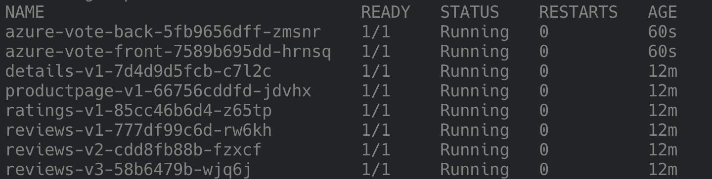
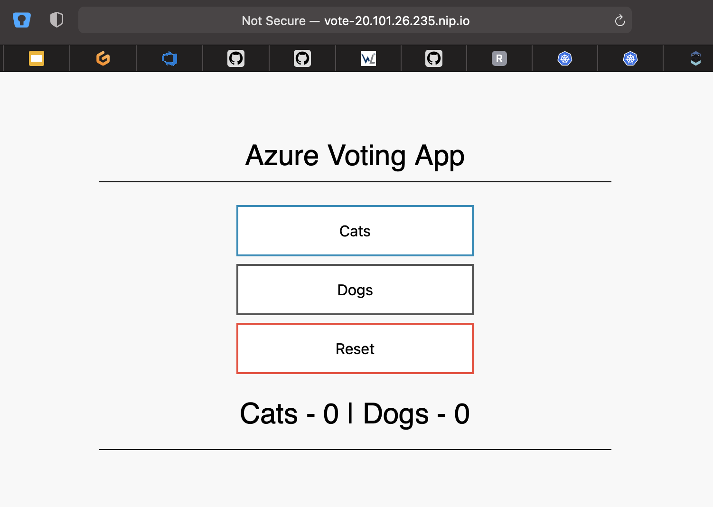

# Ingress Practice

This readme describes the required steps to follow the practice task about ingress.

## Setup

Please follow these steps to create your own Ingress Controller as well as sample applications. You will configure and expose these applications under two different hostnames.

1. Create the ingress controller. We will rely on [NGNIX](https://kubernetes.github.io/ingress-nginx/deploy/) as the Ingress Controller
```bash
kubectl apply -f https://raw.githubusercontent.com/kubernetes/ingress-nginx/controller-v1.0.0/deploy/static/provider/cloud/deploy.yaml
```

Shortly after the deployment the Ingress Controller should be up and running. You can check this by running the following commands:

```bash
kubectl get po -n ingress-nginx
# Get public IP address of Ingress Controller
kubectl get svc -n ingress-nginx ingress-nginx-controller -o=jsonpath="{.status.loadBalancer.ingress[0].ip}"
```

2. Create the guestbook application

```bash
kubectl apply -f https://raw.githubusercontent.com/kubernetes/examples/master/guestbook/all-in-one/guestbook-all-in-one.yaml
```

3. Create the Azure Voting app

```bash
kubectl apply -f https://raw.githubusercontent.com/Azure-Samples/azure-voting-app-redis/master/azure-vote-all-in-one-redis.yaml
```

4. Check if both applications are up and running

```bash
kubectl get po
```

You should receive an output like this:


Now that the apps are running, you can go ahead and create an ingress resource.

Use the following resources to do so:

- Check which services are used to access these applications (`kubectl get svc`)
- Use these hosts for the ingress.yaml. Replace "IP" with the public IP provided by Step 1.
  - Guestbook: guest-IP.nip.io (path: /)
  - Azure-Vote-App: vote-IP.nip.io (path: /)
  - For example: vote-20.101.26.235.nip.io
- Create an ingress resource with the help of [Ingress Documentation](https://kubernetes.io/docs/concepts/services-networking/ingress/)
  - Use the following services and ports:
    - Service: frontend, Port: 80
    - Service: azure-vote-front, Port: 80

5. Deploy the ingress spec

```bash
kubectl apply -f ingress.yaml
```

6. Test hosts by visiting the nip.io url.

Use your browser and visit vote-IP.nip.io (e.g. vote-20.101.26.235.nip.io). You should see the app:



Congratulations! You app is successfully exposed to the web via your Ingress Controller.

## Cleanup

```bash
kubectl delete -f https://raw.githubusercontent.com/kubernetes/examples/master/guestbook/all-in-one/guestbook-all-in-one.yaml

kubectl delete -f https://raw.githubusercontent.com/Azure-Samples/azure-voting-app-redis/master/azure-vote-all-in-one-redis.yaml

kubectl delete -f https://raw.githubusercontent.com/kubernetes/ingress-nginx/controller-v1.0.0/deploy/static/provider/cloud/deploy.yaml

kubectl delete ingress.yaml
```

## Licensing Notes

This practice task uses the following two applications to demonstrate the ingress concept of Kubernetes:
- [Guestbook](https://github.com/kubernetes/examples/blob/master/guestbook/all-in-one/guestbook-all-in-one.yaml) application from the [Kubernetes examples](https://github.com/kubernetes/examples) repository. It is licensed under [Apache License 2.0](https://github.com/kubernetes/examples/blob/master/LICENSE).
- [Azure Voting App](https://github.com/Azure-Samples/azure-voting-app-redis/blob/master/azure-vote-all-in-one-redis.yaml) application from the [Azure Voting App](https://github.com/Azure-Samples/azure-voting-app-redis) repository. It is licensed under [MIT License](https://github.com/Azure-Samples/azure-voting-app-redis/blob/master/LICENSE).

